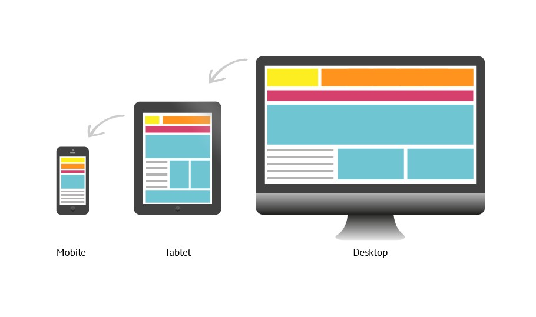

<!DOCTYPE html>
<html lang="pt-BR">
<head>
  <meta charset="UTF-8">
  <title>LucasTera | Serviços</title>
  <link rel="stylesheet" href="style.css">
</head>
<body>
  <main>
    
    <article class="servicos">
      

        <h1>Nossos Serviços</h1>
        <ul>
          <li>
            <h4>Desenvolvimento Web Responsivo</h4>
          </li>
          <figure>
            
          </figure>
          
Criação de sites e aplicações web que se adaptam a qualquer dispositivo, garantindo uma experiência de usuário fluida e eficiente. 
            Nossos desenvolvedores utilizam as tecnologias mais recentes para entregar soluções robustas e escaláveis. 

          <li>
            <h4>Design UI/UX</h4>
          </li>
          <figure>
            
          </figure>
          
Foco na experiência do usuário, criando interfaces intuitivas e atraentes. 
            Nosso time de designers trabalha para garantir que cada interação seja agradável e funcional, aumentando a satisfação do usuário final.

          <li>
            <h4>Marketing Digital</h4>
          </li>
          <figure>
            
          </figure>
          
Desenvolvimento de estratégias de marketing digital personalizadas para aumentar a visibilidade da sua marca e atrair mais clientes. 
              Oferecemos serviços de SEO, gestão de redes sociais, campanhas de anúncios online e muito mais.

        </ul>
      

    </article>

  </main>
  
</body>
</html>